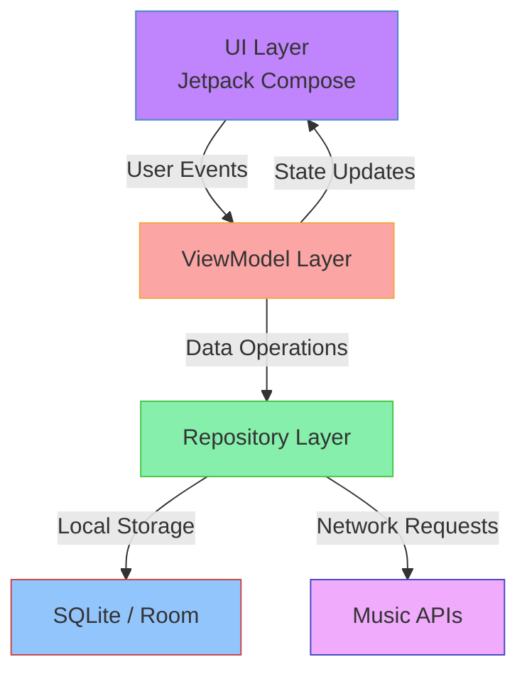

<div align="center">


[](https://kotlinlang.org)
[](https://developer.android.com/studio)
[](https://developer.android.com/jetpack/compose)

*A native Android music streaming application inspired by Apple Music, uses Spotify Android SDK, built with Kotlin and Jetpack Compose* 🎵

[Key Features](#-key-features) • [Tech Stack](#-tech-stack) • [Installation](#-installation) • [Team](#-team-members)

</div>

## ✨ Key Features

<div align="center">
  <table>
    <tr>
      <td width="33%" align="center">
        
        <br/>
        <b>Real-time Sync</b>
        <br/>
        <sub>Seamless music synchronization via spotify</sub>
      </td>
      <td width="33%" align="center">
        
        <br/>
        <b>Music Streaming</b>
        <br/>
        <sub>High-quality audio streaming</sub>
      </td>
      <td width="33%" align="center">
        
        <br/>
        <b>Smart Playlists</b>
        <br/>
        <sub>Intelligent music organization</sub>
      </td>
    </tr>
  </table>
</div>

## 🛠 Tech Stack

<div align="center">

### Core Technologies


### Backend & Storage


### Development Tools


</div>

## 🎯 Project Architecture



## 👥 Team Members

<div align="center">

| Role | Name | Student ID |
|:---:|:---:|:---:|
| **🛠️ Team Lead & Fullstack** | Huỳnh Chí Hên | `23520455` |
| **⚙️ Backend Developer** | Đặng Trần Anh Hào | `23520444` |
| **🔧 Backend SDK Developer** | Nguyễn Quốc Hải | `23520419` |
| **🎨 UI Designer & Frontend** | Nguyễn Hữu Duy | `23520374` |
| **💻 Frontend Developer** | Nguyễn Văn Hào | `23520448` |

</div>

## 📦 Installation

<details>
<summary>Click to expand installation steps</summary>

### Prerequisites
* Android Studio
* Git

### Steps
1. Create and navigate to project directory
```bash
mkdir tiu-music && cd tiu-music
```

2. Clone the repository
```bash
git clone https://github.com/LwkPhoenix/TIUMusic.git
```

3. Open in Android Studio
```
File > Open > TIUMusic
```

4. Create an account to login

</details>


## 📚 Resources
- [Project Designs](https://www.figma.com/community/file/1377364496499750549/apple-music-ui-kit)
- [Team Drive](https://drive.google.com/drive/folders/1qdDjAw2VQ9wsmv2D0wbnXL9PBu6ataJx)

---

<div align="center">

*Built with ❤️ by UIT Students*


</div>
